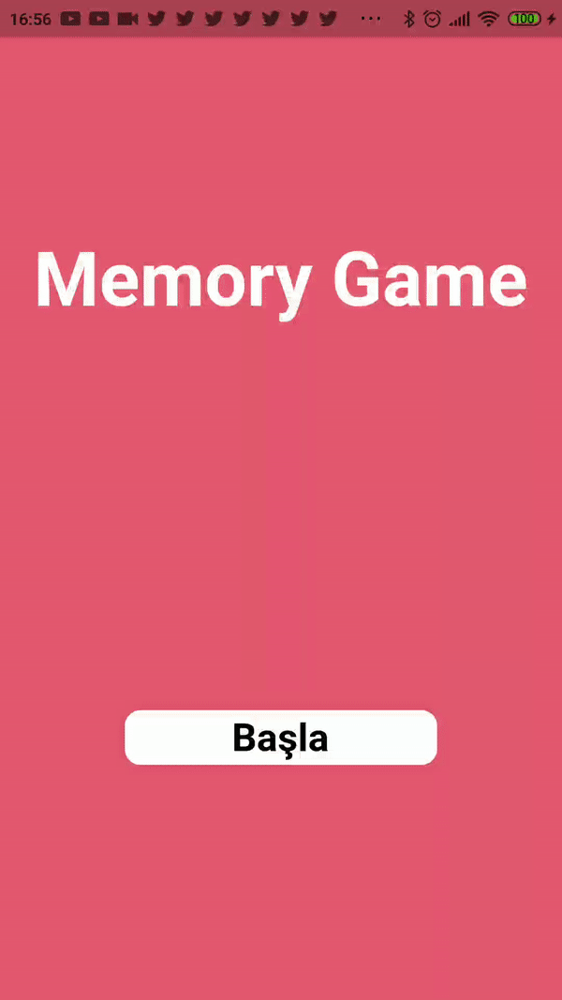

# Hafıza Oyunu

---

## 1.Proje Açıklaması
Flutter Framework ile yapılmış bir Mobil Kart hafıza oyunudur.
Oyun içerisinde giriş ekranında bulunan başla tuşuna basıldıktan sonra oyuna katılım sağlayacak kullanıcının bir kullanıcı adı girilmesi istenmektedir.
Oyuncu 1.seviye veya 2. seviye olmak üzere 2 farklı zorluk seviyesinden oynamak istediği seviyeyi seçerek oyuna giriş yapıyor.
1. zorluk seviyesinde 4x4 lük kart sistemi, 2. zorluk seviyesinde ise 6x6 lık kart sistemi kullanılmıştır.
Ardından ise oyuncu seçtiği zorluk seviyesine göre (16 veya 36 tane) içinde resimler bulunan kartlardan aynı resme sahip olan kartları eşleştirmeye çalışmaktadır.
Oyuncu eşleştirmeleri bitirdikten sonra ekranda kazandınız alerti belirmektedir dolayısıyla oyun sonlanmış olacaktır.
Eğer istenise yeni oyun butonuna basılarak ana menüye dönüş sağlanabilir.
Her oynandığında girilen kullanıcı adları temel alınarak kullanıcının oyun sırasında kaç hamle harcadığı ve bitirme süresi giriş ekranında bulunan tabloda sıralancaktır.
Sıralama en yüksek skordan en düşük skora doğru ilerlemektedir.
Oynayan kullanıcıların skorları oyun içerisinde sürekli olarak tutulmaktadır. (kendi rekorunuzu zorlayabilirsiniz :D)
Dosyalar arasında uygulamanın bir apksı bulunmaktadır mobil cihazınıza indirerek deneyebilirsiniz.
